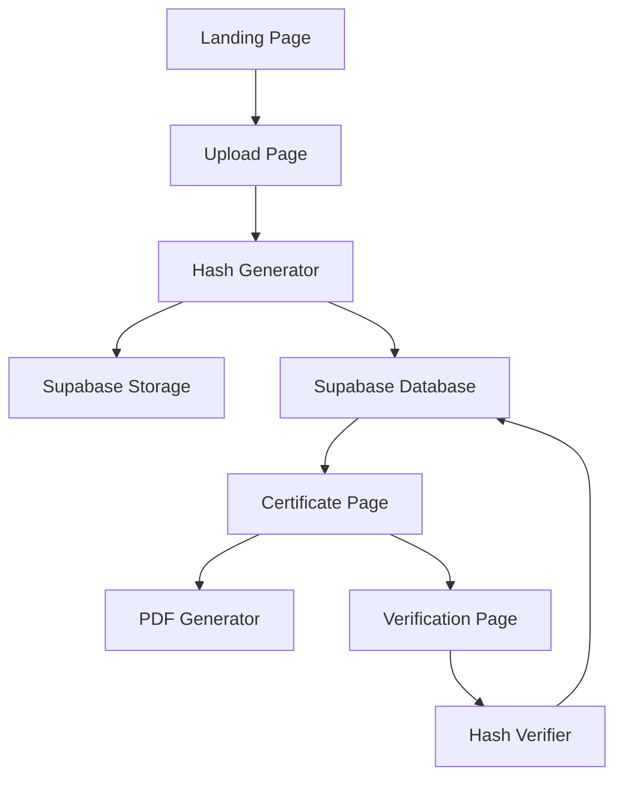

# Design Document: EXTATE Document Protection

## Overview

EXTATE is a web-based document protection platform that provides cryptographic proof of property ownership for families in developing countries. The system creates tamper-evident certificates by computing SHA-256 fingerprints of ownership documents in the browser, storing them securely in Supabase, and providing verification capabilities.

The application consists of four main user flows:

1. Landing page introducing the service
2. Document upload and registration flow
3. Certificate generation and display
4. Document verification flow

All cryptographic operations (SHA-256 hashing) occur client-side using the Web Crypto API, ensuring document privacy and reducing server load.

## Architecture

### System Components



### Technology Stack

- **Frontend Framework**: Next.js 14 with App Router
- **Styling**: Tailwind CSS
- **Database & Storage**: Supabase (PostgreSQL + Storage)
- **Cryptography**: Web Crypto API (browser-native)
- **PDF Generation**: jsPDF library
- **Deployment**: Vercel

### Page Structure

```
/                    - Landing page
/upload              - Document upload form
/certificate/[id]    - Certificate display and download
/verify/[id]         - Document verification interface
```

## Components and Interfaces

### 1. Landing Page Component

**Purpose**: Introduce the service and guide users to document protection

**Props**: None (static page)

**UI Elements**:
- Hero section with headline
- Problem statement paragraph
- Call-to-action button linking to `/upload`

**Styling**: Clean, trustworthy design with emphasis on security and reliability

---

### 2. Document Upload Component

**Purpose**: Collect document file and metadata for registration

**State Management**:
```typescript
interface UploadFormState {
  file: File | null;
  ownerName: string;
  propertyAddress: string;
  documentType: 'deed' | 'title' | 'inheritance_record' | 'tax_document';
  documentDate: string;
  isSubmitting: boolean;
  submitStep: 'idle' | 'hashing' | 'uploading' | 'registering';
  error: string | null;
  validationErrors: FormValidationResult['errors'];
}
```

**UI Elements**:
- Drag-and-drop file zone (accept: `.pdf,.jpg,.jpeg,.png`) with upload SVG icon, drag-over state (blue border + scale), and green checkmark when file selected
- Text input: Owner name
- Text input: Property address (label updates dynamically based on document type)
- Select dropdown: Document type
- Date input: Document date
- Three-step processing indicator (Reading → Uploading → Registering) shown during submission
- Submit button with step-specific label and spinner

**Validation**:
- All fields required
- File must be PDF or image format
- File size limit: 10MB
- Document type dropdown uses amber border on validation error (not red) to distinguish "incomplete" from "wrong"

**Dynamic Labels** (via `getPropertyAddressLabel()`):
- deed / title → "Property Address"
- inheritance_record → "Estate / Property Description"
- tax_document → "Tax Parcel / Property Address"

---

### 3. Hash Generator Module

**Purpose**: Compute SHA-256 fingerprint of uploaded documents

**Interface**:
```typescript
async function computeSHA256(file: File): Promise<string> {
  const arrayBuffer = await file.arrayBuffer();
  const hashBuffer = await crypto.subtle.digest('SHA-256', arrayBuffer);
  const hashArray = Array.from(new Uint8Array(hashBuffer));
  const hashHex = hashArray.map(b => b.toString(16).padStart(2, '0')).join('');
  return hashHex;
}
```

**Implementation Notes**:
- Uses Web Crypto API (`crypto.subtle.digest`)
- Runs entirely in browser
- Returns lowercase hexadecimal string (64 characters)
- No server-side processing required

---

### 4. Document Registration Flow

**Purpose**: Store document and metadata in Supabase

**Sequence**:
1. User submits upload form
2. Compute SHA-256 hash of file
3. Upload file to Supabase Storage bucket
4. Insert record into `documents` table
5. Redirect to certificate page with document ID

**Error Handling**:
- Display user-friendly error messages
- Handle network failures gracefully
- Validate file upload success before database insert

---

### 5. Certificate Page Component

**Purpose**: Display official-looking certificate of document registration

**Props**:
```typescript
interface CertificatePageProps {
  params: { id: string };
}
```

**Data Fetching**:
```typescript
interface DocumentRecord {
  id: string;
  owner_name: string;
  property_address: string;
  document_type: string;
  document_date: string;
  fingerprint: string;
  file_url: string;
  created_at: string;
}
```

**Visual Design Philosophy**:

The certificate page is the emotional core of the application. It must convey authority, permanence, and trustworthiness. The design should take direct inspiration from official government documents and legal certificates that families would frame and preserve.

**Design Elements**:

1. **Official Seal or Emblem**
   - Positioned prominently at the top center
   - Could be a custom EXTATE seal with cryptographic symbolism (lock, shield, or hash pattern)
   - Should feel governmental and authoritative
   - Consider embossed or raised appearance using CSS shadows

2. **Typography**
   - Use serif fonts that evoke legal documents (e.g., Crimson Text, Libre Baskerville, or EB Garamond)
   - Avoid modern sans-serif web UI fonts
   - Hierarchy: Large formal title, medium body text, small fine print
   - Consider all-caps for section headers (traditional legal style)

3. **Layout Structure**
   - Formal, centered alignment
   - Wide margins (like official documents)
   - Clear visual separation between sections
   - Border or decorative frame around the entire certificate
   - Consider ornamental corner elements

4. **Content Sections** (in order):
   - **Header**: "CERTIFICATE OF DOCUMENT REGISTRATION" in formal typography
   - **Seal**: Official emblem or seal
   - **Declaration**: "This certifies that the following property document has been registered..."
   - **Owner Information**: Name and property address in formal presentation
   - **Document Details**: Type and date
   - **Fingerprint**: The SHA-256 hash displayed prominently in monospace font, possibly in a bordered box
   - **Registration Details**: Timestamp and unique ID
   - **Footer**: Fine print about verification and authenticity

5. **Color Palette**
   - Traditional document colors: cream/off-white background, dark text
   - Accent colors: Deep blue, burgundy, or forest green (government document aesthetic)
   - Gold or bronze for seal and decorative elements
   - Avoid bright, modern web colors

6. **Print Considerations**
   - Design must look professional when printed
   - Use print-friendly colors and sufficient contrast
   - Ensure proper page breaks for PDF generation
   - Consider A4/Letter paper dimensions

**UI Elements**:
- Certificate display (styled as official document)
- Copy button for SHA-256 fingerprint (clipboard icon → "Copied" confirmation for 2s)
- "Download PDF" button
- "Share Verify Link" button (Web Share API on mobile, clipboard fallback on desktop)
- "Verify This Document" button (navigation to verification page)
- Formatted certificate ID: `EXTATE-XXXX-XXXX` derived from first 8 chars of UUID

**Certificate ID Format**:
```typescript
function formatCertificateId(id: string): string {
  const clean = id.replace(/-/g, '').toUpperCase();
  return `EXTATE-${clean.slice(0, 4)}-${clean.slice(4, 8)}`;
}
```

**Styling Notes**:
- The certificate should feel like something a family would print, frame, and keep in a safe
- It should NOT look like a generic web UI component
- Think: birth certificate, marriage license, property deed, university diploma
- The design should inspire confidence and convey permanence

---

### 6. PDF Generator Module

**Purpose**: Create downloadable PDF version of certificate

**Interface**:
```typescript
function generateCertificatePDF(document: DocumentRecord): void {
  // Uses jsPDF to create PDF
  // Mirrors the visual design of the web certificate
  // Initiates browser download
}
```

**Implementation**:
- Use jsPDF library
- Match web certificate styling as closely as possible
- Include all certificate information
- Filename format: `EXTATE_Certificate_[owner_name]_[id].pdf`

---

### 7. Verification Page Component

**Purpose**: Allow users to verify document authenticity

**Props**:
```typescript
interface VerificationPageProps {
  params: { id: string };
}
```

**State Management**:
```typescript
interface VerificationState {
  storedFingerprint: string;
  uploadedFile: File | null;
  computedFingerprint: string | null;
  isVerifying: boolean;
  verificationResult: 'match' | 'mismatch' | null;
  lastVerificationError?: string;
}
```

**UI Elements**:
- Full-width result banner (green `bg-green-600` or red `bg-red-600`) with large SVG icon — appears above all other content when result is available
- Registered document metadata card with uppercase tracking labels, formatted dates, and dynamic property address label
- Drag-and-drop file upload zone (matching upload page styling)
- Verification button with spinner
- Fingerprint comparison section (stored vs computed) shown after verification
- "Register a Document" CTA section at bottom linking to `/upload`

**Verification Logic**:
1. Fetch stored fingerprint from database
2. User uploads file to verify
3. Compute SHA-256 hash of uploaded file
4. Compare computed hash with stored hash
5. Display full-width result banner with clear visual indicator
6. Show side-by-side fingerprint comparison below

---

## Certificate Design System

The certificate page uses a custom Tailwind color palette defined in `tailwind.config.ts` to achieve a government-document aesthetic. These colors are used consistently across the web certificate and PDF output.

### Custom Color Tokens

| Token | Hex | Usage |
|-------|-----|-------|
| `certificate-gold` | `#D4AF37` | Borders, decorative accents, seal ring |
| `certificate-deep-blue` | `#1E3A5F` | Headings, official text, seal background |
| `certificate-cream` | `#F5F5DC` | Section backgrounds |
| `certificate-off-white` | `#FAF9F6` | Certificate body background |
| `certificate-dark-text` | `#2C2C2C` | Body text, fingerprint background |
| `certificate-bronze` | `#8B6914` | Secondary accent borders |
| `certificate-forest-green` | `#2D5016` | Verify button |

### Certificate Layout Structure

```
┌─────────────────────────────────────────┐
│  ═══ Gold gradient border (top) ═══     │
│                                         │
│           [Official Seal]               │
│    CERTIFICATE OF DOCUMENT REGISTRATION │
│         ─────── gold rule ───────       │
│   "This certifies that..." (italic)     │
│                                         │
│  ┌── Property Owner (gold left border) ─┤
│  │  Owner Name                          │
│  │  [Dynamic Address Label]             │
│  │  Property Address                    │
│  └──────────────────────────────────────┤
│                                         │
│  [Document Type]    [Document Date]     │
│                                         │
│  ┌── Fingerprint (gold border box) ─────┤
│  │  SHA-256:                  [Copy]    │
│  │  [monospace hash on dark bg]         │
│  └──────────────────────────────────────┤
│                                         │
│  ┌── Registration Details (bronze) ─────┤
│  │  Registered: [formatted timestamp]   │
│  │  Certificate ID: EXTATE-XXXX-XXXX    │
│  └──────────────────────────────────────┤
│                                         │
│  ─────── gold rule ───────              │
│  [footer fine print]                    │
│                                         │
│  ═══ Gold gradient border (bottom) ═══  │
└─────────────────────────────────────────┘
```

---

## Data Models

### Supabase Storage Bucket

**Bucket Name**: `documents`

**Configuration**:
- **Public**: `true` (public access for simplicity)
- File size limit: 10MB
- Allowed MIME types: `application/pdf`, `image/jpeg`, `image/png`

**Rationale for Public Access**:
Documents are identified only by UUID, which provides sufficient obscurity. Public access simplifies the architecture by allowing direct public URLs to be stored in the database without requiring signed URL generation or authentication flows.

**File Path Structure**: `{uuid}.{extension}`

**Storage URL Format**: Direct public URLs will be stored in the `file_url` field of the database.

---

### Database Table: `documents`

**Table Name**: `documents`

**Schema**:
```sql
CREATE TABLE documents (
  id UUID PRIMARY KEY DEFAULT gen_random_uuid(),
  owner_name TEXT NOT NULL,
  property_address TEXT NOT NULL,
  document_type TEXT NOT NULL,
  document_date TEXT NOT NULL,
  fingerprint TEXT NOT NULL,
  file_url TEXT NOT NULL,
  created_at TIMESTAMPTZ NOT NULL DEFAULT NOW()
);
```

**Field Descriptions**:
- `id`: Unique identifier (auto-generated UUID)
- `owner_name`: Full name of property owner
- `property_address`: Physical address of property
- `document_type`: One of: 'deed', 'title', 'inheritance_record', 'tax_document'
- `document_date`: Date on the original document (stored as text)
- `fingerprint`: SHA-256 hash (64-character hex string)
- `file_url`: Supabase Storage public URL for the uploaded file
- `created_at`: Registration timestamp (auto-generated)

**Indexes**:
- Primary key on `id`
- Index on `fingerprint` for verification lookups

---

### API Routes

**Next.js Server Actions**:

1. **Upload Document Action**
```typescript
async function uploadDocument(formData: FormData): Promise<{ id: string }>;
```

2. **Get Document Action**
```typescript
async function getDocument(id: string): Promise<DocumentRecord>;
```

3. **Verify Document Action** (optional - can be client-side only)
```typescript
async function verifyDocument(id: string, file: File): Promise<boolean>;
```


## Correctness Properties

*A property is a characteristic or behavior that should hold true across all valid executions of a system—essentially, a formal statement about what the system should do. Properties serve as the bridge between human-readable specifications and machine-verifiable correctness guarantees.*

### Property 1: SHA-256 Hash Computation Correctness

*For any* uploaded file, the computed SHA-256 hash must be a valid 64-character lowercase hexadecimal string that uniquely represents the file contents.

**Validates: Requirements 3.1, 8.3**

---

### Property 2: Document Upload and Storage Completeness

*For any* document with computed fingerprint, the system must successfully upload the file to Supabase Storage and create a database record containing all required fields (owner name, property address, document type, document date, fingerprint, file URL, and registration timestamp).

**Validates: Requirements 4.1, 4.2**

---

### Property 3: Post-Registration Redirect

*For any* successfully completed document registration, the system must redirect the user to the certificate page with the correct document ID.

**Validates: Requirements 4.3**

---

### Property 4: Certificate Information Completeness

*For any* document record, the certificate page must display all required information: owner name, property address, document type, document date, fingerprint, and registration timestamp.

**Validates: Requirements 5.1, 5.2, 5.3, 5.4, 5.5, 5.6**

---

### Property 5: PDF Generation Completeness

*For any* document record, the generated PDF must contain all certificate information that appears on the web certificate page.

**Validates: Requirements 6.2**

---

### Property 6: Verification Fingerprint Display

*For any* document being verified, the verification page must display the stored fingerprint from the database.

**Validates: Requirements 8.1**

---

### Property 7: Verification Result Accuracy

*For any* verification attempt, the system must correctly compute the uploaded file's hash, compare it with the stored fingerprint, and display the appropriate indicator (green checkmark for match, red warning for mismatch) along with both fingerprints for comparison.

**Validates: Requirements 9.1, 9.2, 9.3**

---

### Property 8: UUID Generation and Uniqueness

*For any* newly created document record, the system must automatically generate a unique UUID as the primary key.

**Validates: Requirements 10.1, 10.9**

---

### Property 9: Automatic Timestamp Generation

*For any* newly created document record, the system must automatically set the registration timestamp to the current time with timezone information.

**Validates: Requirements 10.10**

---

## Error Handling

### Error Categories and Responses

| Error Category | Scenario | User-Facing Message | System Behavior |
|---------------|----------|---------------------|-----------------|
| **File Validation** | File size exceeds 10MB | "File size must be under 10MB. Please choose a smaller file." | Prevent form submission, highlight file input |
| **File Validation** | Invalid file type | "Please upload a PDF or image file (JPG, PNG)." | Prevent form submission, highlight file input |
| **Form Validation** | Missing required fields | "Please fill in all required fields." | Highlight empty fields, prevent submission |
| **Hash Computation** | Web Crypto API failure | "Unable to process file. Please try again or use a different browser." | Log error, allow retry |
| **Storage Upload** | Supabase storage failure | "Upload failed. Please check your connection and try again." | Log error details, allow retry |
| **Database Insert** | Database write failure | "Registration failed. Please try again." | Log error details, rollback storage upload if possible |
| **Network** | Connection timeout | "Connection timeout. Please check your internet connection." | Allow retry, preserve form data |
| **Data Fetch** | Document not found | "Certificate not found. Please check the URL." | Display 404 page with link to home |
| **PDF Generation** | jsPDF failure | "Unable to generate PDF. Please try downloading again." | Log error, allow retry |
| **Verification** | Hash computation failure | "Unable to verify file. Please try again." | Log error, allow retry |

### Error Handling Principles

1. **User-Friendly Messages**: Never expose technical error details to users
2. **Actionable Guidance**: Tell users what they can do to resolve the issue
3. **Graceful Degradation**: Allow users to retry operations without losing data
4. **Comprehensive Logging**: Log all errors with context for debugging
5. **Visual Feedback**: Use color coding and icons to indicate error states

### Critical Error Scenarios

**Scenario 1: Hash Computed but Upload Fails**
- Store hash temporarily in browser state
- Allow user to retry upload without recomputing hash
- If retry fails, allow user to start over

**Scenario 2: Upload Succeeds but Database Insert Fails**
- Log the orphaned file URL
- Display error to user
- Consider cleanup job to remove orphaned files

**Scenario 3: Browser Doesn't Support Web Crypto API**
- Detect on page load
- Display prominent warning
- Suggest modern browser alternatives (Chrome, Firefox, Safari, Edge)

---

## Testing Strategy

### Testing Approach

The EXTATE application will use a comprehensive testing strategy combining unit tests and integration tests to ensure correctness and reliability.

### Unit Testing

**Purpose**: Verify individual functions and components in isolation

**Framework**: Jest with React Testing Library (for Next.js components)

**Coverage Areas**:

1. **Hash Generation Module**
   - Test `computeSHA256()` with known file contents and expected hashes
   - Test with various file sizes (small, medium, large)
   - Test error handling when Web Crypto API is unavailable

2. **Form Validation**
   - Test required field validation
   - Test file type validation (PDF, JPG, PNG accepted; others rejected)
   - Test file size validation (10MB limit)
   - Test date format validation

3. **Component Rendering**
   - Test Landing Page renders all required elements
   - Test Upload Form renders all input fields
   - Test Certificate Page renders with mock data
   - Test Verification Page renders with mock data

4. **PDF Generation**
   - Test `generateCertificatePDF()` with mock document data
   - Verify PDF contains all required fields
   - Test filename format

5. **Verification Logic**
   - Test hash comparison (matching hashes)
   - Test hash comparison (non-matching hashes)
   - Test display of verification results

**Example Unit Tests**:

```typescript
describe('computeSHA256', () => {
  it('should compute correct SHA-256 hash for known input', async () => {
    const file = new File(['test content'], 'test.txt');
    const hash = await computeSHA256(file);
    expect(hash).toHaveLength(64);
    expect(hash).toMatch(/^[a-f0-9]{64}$/);
  });

  it('should return consistent hash for same file', async () => {
    const file = new File(['test content'], 'test.txt');
    const hash1 = await computeSHA256(file);
    const hash2 = await computeSHA256(file);
    expect(hash1).toBe(hash2);
  });
});

describe('Form Validation', () => {
  it('should reject files larger than 10MB', () => {
    const largeFile = new File([new ArrayBuffer(11 * 1024 * 1024)], 'large.pdf');
    expect(validateFileSize(largeFile)).toBe(false);
  });

  it('should accept valid file types', () => {
    expect(validateFileType('application/pdf')).toBe(true);
    expect(validateFileType('image/jpeg')).toBe(true);
    expect(validateFileType('image/png')).toBe(true);
  });

  it('should reject invalid file types', () => {
    expect(validateFileType('text/plain')).toBe(false);
    expect(validateFileType('application/zip')).toBe(false);
  });
});
```

---

### Integration Testing

**Purpose**: Verify end-to-end workflows and component interactions

**Framework**: Playwright or Cypress for E2E testing

**Coverage Areas**:

1. **Complete Registration Flow**
   - Navigate from landing page to upload page
   - Fill out form with valid data
   - Upload a test document
   - Verify redirect to certificate page
   - Verify certificate displays correct information

2. **Certificate Download Flow**
   - Navigate to certificate page
   - Click download button
   - Verify PDF file is downloaded
   - Verify PDF contains correct information

3. **Verification Flow**
   - Navigate to verification page
   - Upload the original document
   - Verify green checkmark appears
   - Upload a different document
   - Verify red warning appears

4. **Database Integration**
   - Test document record creation
   - Test document record retrieval
   - Test UUID generation
   - Test timestamp generation

5. **Storage Integration**
   - Test file upload to Supabase Storage
   - Test public URL generation
   - Test file retrieval from public URL

**Example Integration Test**:

```typescript
describe('Document Registration Flow', () => {
  it('should complete full registration workflow', async () => {
    // Navigate to landing page
    await page.goto('/');
    await page.click('text=Protect Your Documents');

    // Fill out upload form
    await page.setInputFiles('input[type="file"]', 'test-document.pdf');
    await page.fill('input[name="ownerName"]', 'John Doe');
    await page.fill('input[name="propertyAddress"]', '123 Main St');
    await page.selectOption('select[name="documentType"]', 'deed');
    await page.fill('input[name="documentDate"]', '2024-01-15');

    // Submit form
    await page.click('button[type="submit"]');

    // Verify redirect to certificate page
    await page.waitForURL(/\/certificate\/.+/);

    // Verify certificate displays correct information
    await expect(page.locator('text=John Doe')).toBeVisible();
    await expect(page.locator('text=123 Main St')).toBeVisible();
    await expect(page.locator('text=deed')).toBeVisible();
  });
});
```

---

### Test Data Management

**Mock Data**:
- Create realistic test documents (sample PDFs and images)
- Use consistent test data for predictable hash values
- Create fixtures for document records

**Test Database**:
- Use separate Supabase project for testing
- Reset database state between test runs
- Use transactions for test isolation where possible

**Test Storage**:
- Use separate storage bucket for testing
- Clean up uploaded files after tests
- Mock storage operations in unit tests

---

### Continuous Integration

**CI Pipeline**:
1. Run unit tests on every commit
2. Run integration tests on pull requests
3. Generate code coverage reports
4. Fail builds if tests fail or coverage drops below threshold

**Coverage Goals**:
- Unit test coverage: 80% minimum
- Integration test coverage: All critical user flows
- Focus on correctness properties and error handling

---

### Manual Testing Checklist

Before deployment, manually verify:

- [ ] Landing page loads and displays correctly
- [ ] Upload form accepts valid files and rejects invalid files
- [ ] Hash computation works in multiple browsers (Chrome, Firefox, Safari, Edge)
- [ ] Certificate page displays all information correctly
- [ ] Certificate design looks professional and printable
- [ ] PDF download works and contains correct information
- [ ] Verification correctly identifies matching documents
- [ ] Verification correctly identifies non-matching documents
- [ ] Error messages are clear and helpful
- [ ] Mobile responsive design works on various screen sizes
- [ ] Public storage URLs are accessible without authentication
